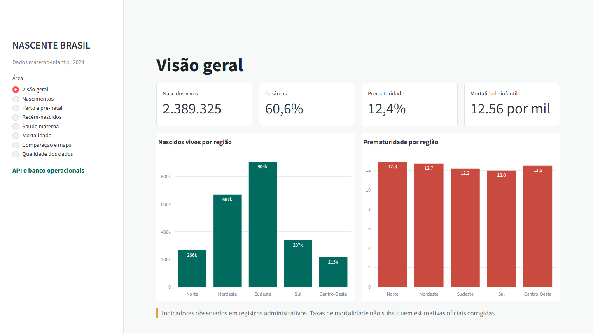
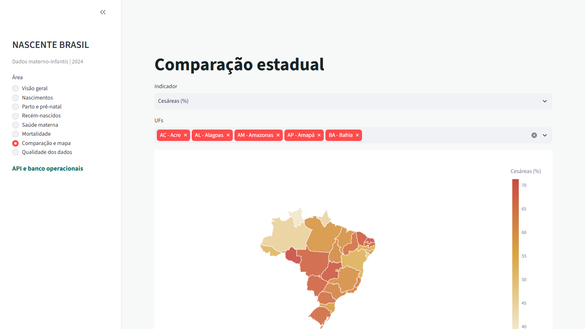

# NASCENTE BRASIL

Plataforma nacional de dados materno-infantis com ingestão auditável,
camadas RAW/Silver/Gold, PostgreSQL, dbt, Airflow, FastAPI e Streamlit.

O projeto cobre o fluxo completo, da aquisição e validação dos dados públicos
até a disponibilização de indicadores por API e dashboard analítico.

## Status

Fases 1 a 17 concluídas. O recorte atual é 2024 e integra:

- SINASC: 2.389.325 nascidos vivos;
- SIM: 1.532.015 óbitos não fetais e indicadores observados materno-infantis;
- SIH/SUS: 14.171.364 AIHs e 873.345 registros classificados nos grupos de morbidade;
- CNES: capacidade hospitalar mensal de 7.284 estabelecimentos;
- IBGE: dimensões oficiais de região, UF e 5.571 municípios;
- SINAN SIFG: 89.934 notificações avaliadas, mantidas fora do Gold por ausência de classificação final.

Os indicadores públicos são disponibilizados somente em Brasil, região e UF.
O nível municipal permanece interno até existir política formal de supressão
de células pequenas.

## Execução Docker

Requer Docker Desktop. A partir da raiz do projeto:

```powershell
Copy-Item .env.example .env
docker compose up -d --build
docker compose ps
```

Serviços locais:

- Dashboard: [http://127.0.0.1:8501](http://127.0.0.1:8501)
- API e OpenAPI: [http://127.0.0.1:8000/docs](http://127.0.0.1:8000/docs)
- Airflow: [http://127.0.0.1:8080](http://127.0.0.1:8080) (`admin` / `admin`, somente desenvolvimento local)
- PostgreSQL: `127.0.0.1:55433`

O serviço `pipeline-init` reconstrói os indicadores de nascimento, publica os
Gold no PostgreSQL e executa as 39 ações dbt antes de liberar API e dashboard.

## Dashboard analítico

O dashboard Streamlit consome exclusivamente a API FastAPI e apresenta:

- visão geral dos principais indicadores nacionais;
- nascimentos por região e UF;
- indicadores de parto, pré-natal e condições dos recém-nascidos;
- série mensal de morbidades maternas por nível territorial;
- mortalidade infantil, neonatal e por causas obstétricas;
- comparação entre UFs com nomes canônicos completos;
- mapa coroplético estadual com geometria oficial do IBGE;
- painel de qualidade, cobertura e limitações dos dados.

A geometria territorial está incorporada em
`dashboard/assets/brazil_states.geojson`. Assim, o mapa funciona localmente e
não depende de um provedor externo de mapas durante a visualização.

### Prévia





## Capturas para LinkedIn

As cinco capturas em PNG, no formato 16:9 e resolução 1440×810, ficam em
`exports/linkedin/`:

- [Visão geral](exports/linkedin/01_visao_geral.png);
- [Nascimentos](exports/linkedin/02_nascimentos.png);
- [Saúde materna](exports/linkedin/03_saude_materna.png);
- [Mortalidade](exports/linkedin/04_mortalidade.png);
- [Mapa estadual](exports/linkedin/05_mapa_estadual.png).

Com o dashboard disponível em `http://127.0.0.1:8501`, elas podem ser
regeneradas por Playwright:

```powershell
python -m pip install playwright
python -m playwright install chromium
python scripts/export_linkedin_screenshots.py
```

O exportador aguarda o carregamento das visualizações, remove controles
técnicos do Streamlit e enquadra cada tela para publicação.

## Execução Python

```powershell
python -m venv .venv
.\.venv\Scripts\python.exe -m pip install -r requirements.txt
$env:PYTHONPATH='src'
.\.venv\Scripts\python.exe -m pytest
```

Validadores por fase estão em `scripts/validate_phase_*.py`. Os principais
comandos de publicação são:

```powershell
.\.venv\Scripts\python.exe scripts/build_birth_indicators.py
.\.venv\Scripts\python.exe scripts/run_phase_11.py
.\.venv\Scripts\python.exe scripts/validate_phase_11.py
dbt build --project-dir dbt --profiles-dir dbt
.\.venv\Scripts\python.exe scripts/validate_phase_14.py
python scripts/validate_dashboard_visual.py
```

## Estrutura

- `src/nascente_brasil/`: ingestão, transformação, validação, banco e API;
- `airflow/dags/`: orquestração e sonda controlada de falha;
- `dbt/`: staging, intermediate, marts, testes e documentação;
- `dashboard/`: aplicação Streamlit;
- `docker/` e `docker-compose.yml`: imagens e composição integral;
- `docs/`: fontes, metodologia, dicionários, qualidade e checkpoints;
- `exports/linkedin/`: capturas prontas para publicação;
- `scripts/export_linkedin_screenshots.py`: exportação automatizada das telas;
- `data/metadata/`: manifestos, checksums e relatórios de execução.

## Política de dados

Arquivos grandes em `data/raw`, `data/processed`, `data/gold` e
`data/quarantine` não são versionados. A reconstrução ocorre por scripts e
pipelines auditáveis. Dados administrativos são descritivos e não substituem
estimativas epidemiológicas oficiais corrigidas.
